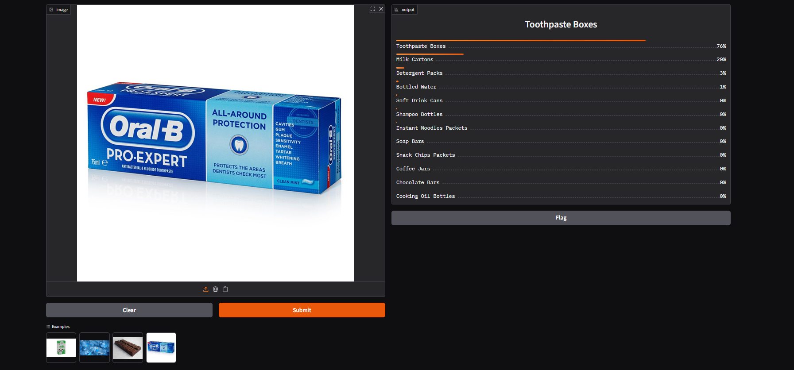

# Package-Recognizer

A deep learning-based image classification application that recognizes and categorizes daily packaging items. Built with FastAI and deployed using Gradio on Hugging Face Spaces.

[](https://github.com/ashfaqfardin/Package-Recognizer/graphs/contributors)
[](https://github.com/ashfaqfardin/Package-Recognizer/issues)
[](https://github.com/ashfaqfardin/Package-Recognizer/issues?q=is%3Aissue+is%3Aopen+label%3A%22good+first+issue%22)
[](https://github.com/ashfaqfardin/Package-Recognizer/commits)
[](https://github.com/ashfaqfardin/Package-Recognizer)
[](LICENSE)

## Table of Contents

- [Overview](#-overview)
- [Features](#-features)
- [Models Used](#-models-used)
- [Gradio Interface](#-gradio-interface)
- [Supported Categories](#-supported-categories)
- [Quick Start](#-quick-start)
- [Project Structure](#-project-structure)
- [Development](#️-development)
- [Data & Models](#-data--models)
- [Technologies Used](#-technologies-used)
- [License](#-license)
- [Contributing](#-contributing)
- [Contact & Support](#-contact--support)

## Overview

Package-Recognizer is a computer vision project designed to automatically classify packaging images into 12 distinct product categories. This application can be used for waste management, recycling sorting, inventory management, and product recognition tasks.

## Features

- **Multi-class Image Classification**: Recognizes 12 packaging categories
- **Fast & Accurate**: Powered by FastAI pre-trained models
- **Easy-to-Use Interface**: Interactive Gradio web interface
- **Cloud Deployment**: Hosted on Hugging Face Spaces for easy access
- **Jupyter Notebooks**: Complete workflow from data preparation to inference
- **Reproducible Pipeline**: Well-documented data cleaning and training process

## Models Used
- **ResNet34**: Primary model for deployment
- **MobileNetV3_Large_100**: Alternative model for experimentation

## Gradio Interface
Upload an image of a packaged product and receive the predicted category along with confidence scores.



## Categories

1. Bottled Water
2. Soft Drink Cans
3. Milk Cartons
4. Snack Chips Packets
5. Chocolate Bars
6. Instant Noodles Packets
7. Toothpaste Boxes
8. Shampoo Bottles
9. Soap Bars
10. Cooking Oil Bottles
11. Coffee Jars
12. Detergent Packs

## Quick Start

### Try the Live Demo

Visit the deployed application on Hugging Face Spaces:
[Package-Recognizer on HF Spaces](https://huggingface.co/spaces/ashfaqfardin/pkg_recognizer)

### Local Installation

#### Prerequisites
- Python 3.12.11 or higher
- pip or conda

#### Setup

1. Clone the repository:
```bash
git clone https://github.com/ashfaqfardin/Package-Recognizer
cd Package-Recognizer
```

2. Install dependencies:
```bash
pip install -r deployment/requirements.txt
```

3. Download the pre-trained model from Google Drive:
   - Models: https://drive.google.com/drive/folders/1OxZww1lAyfiMygizYQcjqISgzzx_Ydl2?usp=sharing
   - Place `pkg_recognizer_v1.pkl` in the `deployment/` directory

4. Run the application:
```bash
cd deployment
python app.py
```

The application will launch at `http://localhost:7860`

## Project Structure

```
Package-Recognizer/
├── deployment/              # Production application
│   ├── app.py              # Gradio interface
│   ├── app.ipynb           # Jupyter version
│   ├── requirements.txt     # Dependencies
│   └── README.md
├── notebooks/              # Development workflow
│   ├── data_prep.ipynb     # Data preparation
│   ├── training_and_data_cleaning.ipynb  # Model training & data cleaning
│   └── inference.ipynb     # Inference examples
├── models/                 # Pre-trained models
│   └── README.md          # Model documentation & download links
├── data/                  # Training datasets
│   └── README.md         # Data documentation & download links
├── docs/                 # Documentation
│   ├── index.md
│   ├── pkg_recognizer.html
│   └── _config.yml
└── README.md            # This file
```

## Development

### Workflow

1. **Data Preparation** (`notebooks/data_prep.ipynb`):
   - Load and explore datasets
   - Prepare data for training

2. **Training & Data Cleaning** (`notebooks/training_and_data_cleaning.ipynb`):
   - Clean and preprocess data
   - Train the FastAI model
   - Export model to `.pkl` format

3. **Inference** (`notebooks/inference.ipynb`):
   - Test the trained model
   - Generate predictions

### Running Notebooks

All notebooks are Jupyter-based and can be run locally:

```bash
jupyter notebook notebooks/
```

## Data & Models

### Data
- Download extracted datasets: https://drive.google.com/drive/folders/1qeTjO90zWc45lGwgF7DqgLb-mmiFoLj-?usp=sharing
- Place in the `data/` directory before running training workflows

### Pre-trained Models
- Download models: https://drive.google.com/drive/folders/1OxZww1lAyfiMygizYQcjqISgzzx_Ydl2?usp=sharing
- Primary model: `pkg_recognizer_v1.pkl` (used for deployment)
- Place in the `deployment/` directory for app.py or relevant notebooks

## Technologies Used

- **FastAI** (2.8.4): Deep learning library
- **Gradio** (5.49.1): Web interface framework
- **Python** (3.12.11): Programming language
- **Jupyter**: Interactive notebooks

## License

MIT License - See [LICENSE](LICENSE) file for details

## Contributing

Contributions are welcome! Please feel free to submit a Pull Request.

## Contact & Support

For questions or issues, please open an issue on the repository.
Email: [imashfaqfardin@gmail.com](mailto:imashfaqfardin@gmail.com)
